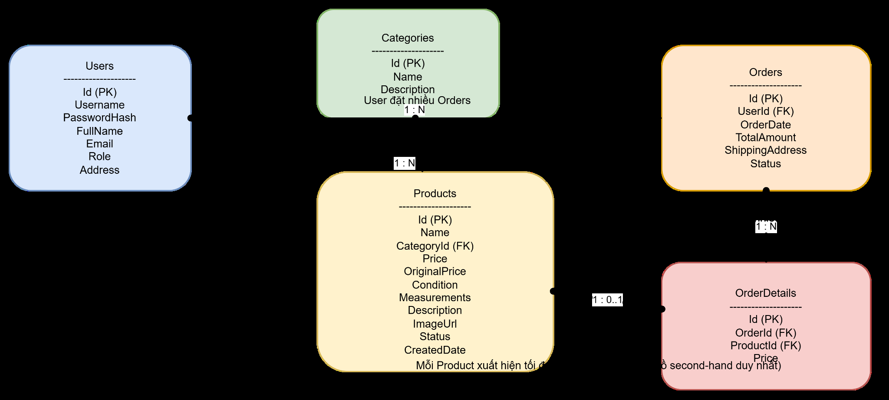

# Phân tích thiết kế hệ thống bán hàng second hand

## I. Kiến trúc tổng thể hệ thống (High-Level Architecture)

### 1.1. Thành phần chính

#### 1. Storefront (Angular Client - Customer UI)

- Chạy trên trình duyệt, build bằng Angular.
- Chức năng: xem/lọc sản phẩm, chi tiết sản phẩm, giỏ hàng, checkout, đăng ký/đăng nhập, lịch sử đơn hàng.
- Giao tiếp với Backend qua REST API + JWT.

#### 2. Admin Dashboard (Angular Client - Admin UI)

- Chạy trên trình duyệt, cũng là một Angular app (có thể là project riêng hoặc module riêng).
- Chức năng: quản lý sản phẩm, danh mục, đơn hàng, thống kê.
- Giao tiếp với Backend qua REST API + JWT, nhưng các API yêu cầu Role = Admin.

#### 3. ASP.NET Core Web API (.NET 8)

Áp dụng Layered Architecture:

**Presentation Layer (API Controllers)**
- Expose các endpoint REST: `/api/products`, `/api/orders`, `/api/auth`, `/api/categories`, `/api/admin/*`...
- Xử lý HTTP: routing, model binding, validation cơ bản, trả HTTP status code.
- Không chứa business logic phức tạp (ủy quyền cho Service Layer).

**Business Logic Layer (Services)**
- Chứa toàn bộ quy tắc nghiệp vụ:
  - Xử lý hàng second-hand: status Available / Sold / Hidden.
  - Đảm bảo tính duy nhất của sản phẩm limited: khi checkout thành công, khóa sản phẩm.
  - Luồng đơn hàng: Pending → Shipping → Completed / Cancelled.
  - Tính toán TotalAmount, kiểm tra quyền (Customer/Admin).
- Là nơi dễ test và mở rộng.

**Data Access Layer (Repositories)**
- Đảm nhiệm truy xuất dữ liệu: đọc/ghi MySQL thông qua EF Core + Pomelo.
- Đóng gói truy vấn: lấy list sản phẩm theo filter, lấy đơn hàng theo user, cập nhật trạng thái sản phẩm, v.v.
- Không chứa logic nghiệp vụ, chỉ tập trung CRUD, query.

#### 4. MySQL Database

- Các bảng chính: Users, Categories, Products, Orders, OrderDetails.
- Được truy cập thông qua EF Core (DbContext + entity mapping).

#### 5. Cross-cutting concerns (chạy xuyên tầng)

- Authentication/Authorization (JWT): middleware trong Web API.
- CORS: cấu hình chỉ cho phép Angular Frontend (localhost:4200).
- Logging, Error Handling: middleware ở backend (không cần vẽ chi tiết, có thể chú thích chung).

---

## II. Mô hình Layered: Mapping thành phần → Tầng

| Tầng | Thành phần cụ thể |
|------|-------------------|
| **Presentation Layer** | Angular Storefront, Angular Admin Dashboard, API Controllers (ProductController, OrderController, ...) |
| **Business Logic Layer** | Services (ProductService, OrderService, AuthService, CategoryService, ReportService...) |
| **Data Access Layer** | Repositories (ProductRepository, OrderRepository, UserRepository, CategoryRepository, ...) + DbContext |
| **Database Layer** | MySQL (Users, Products, Categories, Orders, OrderDetails) |

**Lưu ý:**
- Về mặt frontend, Angular apps cũng thuộc Presentation Layer (Client side).
- Về mặt backend, Controllers cũng là Presentation Layer (Server side).
- Business Logic & Data Access nằm hoàn toàn trong Web API.

---

## III. Sơ đồ kiến trúc hệ thống

**Mô tả ngắn gọn luồng hoạt động của hệ thống:**

### Luồng từ Client (Angular) → Web API

Có 2 ứng dụng phía client:

#### 1. Storefront (Angular - Customer)

- Người dùng xem sản phẩm, lọc, xem chi tiết, thêm vào giỏ, checkout.
- Khi thao tác, Angular gửi request HTTP REST (JSON + JWT) đến Web API. Ví dụ:
  - `GET /api/products`
  - `POST /api/orders`
  - `POST /api/auth/login`

#### 2. Admin Dashboard (Angular - Admin)

- Admin đăng nhập, quản lý sản phẩm, đơn hàng, danh mục, thống kê.
- Request gửi kèm JWT Token có Role=Admin. Ví dụ:
  - `POST /api/admin/products`
  - `GET /api/admin/orders`

#### 3. Web API - Presentation Layer (Controllers)

Khi client gửi request đến:

- Controllers tiếp nhận HTTP request.
- Xác thực JWT (và Role nếu là Admin).
- Thực hiện:
  - Routing
  - Validation input
  - Trả mã lỗi đúng chuẩn HTTP

Sau đó controllers chuyển công việc chính sang Services (không xử lý logic nghiệp vụ phức tạp).

#### 4. Business Logic Layer (Services)

Tầng này xử lý toàn bộ nghiệp vụ của hệ thống:

- Kiểm tra sản phẩm còn "Available" hay đã "Sold".
- Xử lý logic mặt hàng giới hạn (Limited).
- Đặt hàng (Order workflow): Pending → Shipping → Completed.
- Tính tổng hóa đơn.
- Quản lý sản phẩm.
- Quản lý danh mục.
- Quyền của người dùng.
- Báo cáo đơn giản.

Services chỉ tập trung đúng nghiệp vụ → không truy cập database trực tiếp.
Khi cần dữ liệu, Services gọi tiếp xuống Repository.

#### 5. Data Access Layer (Repositories + EF Core)

Nhiệm vụ:

- Thực hiện các thao tác CRUD:
  - Lấy danh sách sản phẩm (kèm filter).
  - Tạo đơn hàng.
  - Cập nhật trạng thái sản phẩm.
  - Lấy đơn theo user.
- Dùng EF Core + Pomelo để giao tiếp MySQL.
- Không chứa logic nghiệp vụ.

Kết quả truy vấn được trả lên Services.

#### 6. MySQL Database

Các Repository thực hiện truy cập:

- Users
- Products
- Categories
- Orders
- OrderDetails

Data trả về → Repository → Service → Controller → Angular UI.

### 5. Kết luận luồng dữ liệu

**Client Angular → Controllers → Services → Repositories → MySQL** và sau đó response trả ngược lại theo chiều ngược lại.

**Cách luồng di chuyển:**

1. Angular gửi request
2. API Controllers nhận request
3. Controllers gọi Services xử lý nghiệp vụ
4. Services gọi Repository để truy vấn MySQL
5. Repository đọc/ghi dữ liệu
6. Kết quả trả về Services
7. Service trả về Controller
8. Controller trả JSON response cho Angular
9. Angular hiển thị kết quả trên UI

---

## IV. Luồng Checkout và xử lý Race Condition

### 1. User chọn sản phẩm và thêm vào giỏ hàng

- User xem sản phẩm có status = "Available"
- Thêm vào giỏ hàng (Cart) - chỉ lưu ở phía client (localStorage hoặc state)

### 2. User nhấn "Checkout"

- Angular gửi request đến Backend: `POST /api/orders`
- Request chứa: danh sách sản phẩm, thông tin giao hàng

### 3. Backend nhận request và kiểm tra trạng thái sản phẩm

- Service kiểm tra từng sản phẩm trong đơn:
  - Nếu có sản phẩm nào Status ≠ "Available" → trả lỗi ngay
  - Nếu tất cả đều "Available" → tiếp tục

### 4. LOCK sản phẩm (Atomic Operation)

- Backend dùng transaction hoặc câu lệnh atomic (`UPDATE WHERE Status = Available`)
- Chỉ một người có thể lock thành công

Có 2 nhánh:

#### Trường hợp LOCK thất bại

**Nguyên nhân:**
- Một user khác đã lock sản phẩm trước trong cùng thời điểm.

**Hệ thống trả về:**
- Thông báo: "Người khác vừa mua sản phẩm này"
- Hủy quá trình Checkout

→ Đây là logic chống race-condition.

#### Trường hợp LOCK thành công

Hệ thống đánh dấu sản phẩm tạm thời khóa để đảm bảo:

- Không ai khác có thể thao tác mua trong lúc đơn đang được tạo
- Tránh mất đồng bộ giữa lúc kiểm tra và lúc tạo đơn

Tiếp tục sang bước tiếp theo.

### 5. Tạo đơn hàng (Order = Pending)

Khi đã lock thành công:

- Tạo Order:
  - UserId
  - List sản phẩm
  - Giá tiền
  - Thông tin giao hàng
  - Thời gian tạo
  - Status = Pending
- Tạo OrderDetails cho từng sản phẩm

Đây là bước chính thức xác nhận giao dịch được tạo trong hệ thống.

### 6. Cập nhật sản phẩm thành Sold

Sau khi order được tạo:

- Sản phẩm được cập nhật trạng thái: **Status = Sold**
- → Điều này chính thức "khóa" sản phẩm khỏi hệ thống
- → Các user khác vào website sẽ thấy sản phẩm bị làm mờ / không mua được.

### 7. Kết thúc quy trình

Hệ thống gửi phản hồi:

**Thành công:**
- "Checkout thành công"
- Trả về mã đơn hàng
- User được chuyển sang màn hình Order Success

**Thất bại (ở nhánh song song):**
- "Sản phẩm đã bán"
- "Người khác vừa mua sản phẩm này"
- Không tạo đơn

---

## V. Sơ đồ Thực thể Quan hệ (ERD - Conceptual Level)

### Giải thích nhanh về ERD (logic conceptual):

#### Users - Orders:
- 1 User có thể có N Orders.
- Một Order thuộc về đúng 1 User.

#### Categories - Products:
- 1 Category có nhiều Products.
- Mỗi Product thuộc đúng 1 Category.

#### Orders - OrderDetails:
- 1 Order có nhiều dòng OrderDetails.
- Mỗi OrderDetail thuộc về đúng 1 Order.

#### Products - OrderDetails (điểm quan trọng):
- Mỗi sản phẩm second-hand là duy nhất → tại thời điểm đã bán, Product chỉ được gắn vào tối đa 1 OrderDetail.
- Quan hệ khái niệm: Product 1 - 0..1 OrderDetail (0 nếu chưa bán, 1 nếu đã bán).
- Trong sơ đồ: hiển thị là **1 : 0..1** để nhấn mạnh logic "mỗi sản phẩm chỉ được bán đúng 1 lần".

---

## VI. UI FLOW - NAVIGATION MAP (Từ Trang Chủ → Mua Hàng Thành Công)

### 1. Home Page (Trang chủ)

**Mục đích:**
- Hiển thị danh sách sản phẩm mới nhất
- Gợi ý các loại sản phẩm / danh mục
- Cho phép người dùng bắt đầu hành trình mua sắm

**Từ Home Page, user có thể điều hướng đến:**
- Product Listing (Danh sách sản phẩm)
- Product Detail (Chi tiết sản phẩm)
- Login / Register
- Cart (Giỏ hàng)
- Category Listing (lọc theo danh mục)

### 2. Product Listing Page (Danh sách sản phẩm)

**Chức năng:**
- Lọc theo: giá, loại, size, độ mới
- Xem nhãn "Hàng mới về", "Đã bán (mờ)"

**Từ đây, user có thể chuyển đến:**
- Product Detail Page (khi nhấn vào 1 sản phẩm)
- Home Page (back)
- Login / Register
- Cart

### 3. Product Detail Page (Chi tiết sản phẩm)

**Hiển thị:**
- Ảnh sản phẩm (zoom / gallery)
- Giá bán, độ mới, số đo, mô tả lỗi
- Trạng thái: **Available** - cho phép thêm vào giỏ
- Trạng thái: **Sold** — hiển thị mờ, không mua được

**User có thể điều hướng đến:**
- Add to Cart → chuyển đến Cart Page
- Product Listing
- Home Page
- Login/Register (nếu chưa đăng nhập và muốn checkout)

### 4. Cart Page (Giỏ hàng)

**Chức năng:**
- Xem danh sách sản phẩm đã thêm
- Xóa sản phẩm
- Tổng tiền tạm tính
- Nút Proceed to Checkout

**Điều hướng:**
- → Checkout Page (nếu user đã đăng nhập)
- Login Page (nếu user chưa đăng nhập → bị redirect)
- Product Listing / Product Detail
- Home Page

### 5. Login Page (Đăng nhập)

(Dành cho user chưa đăng nhập nhưng bấm Checkout)

**Chức năng:**
- Nhập username/email + password
- Lấy JWT token

**Điều hướng:**
- Register Page (nếu chưa có tài khoản)
- Back to Cart
- → Checkout Page (khi login thành công)

### 6. Register Page (Đăng ký)

**Chức năng:**
- Tạo tài khoản thành viên

**Điều hướng:**
- Login Page (sau khi đăng ký thành công)
- Back to Cart / Product Listing

### 7. Checkout Page (Thông tin giao hàng + xác nhận thanh toán)

**Hiển thị:**
- Danh sách sản phẩm trong đơn
- Tổng tiền
- Form nhập thông tin giao hàng
- Nút Confirm Order

**Điều hướng:**
- Checkout Processing (gọi API - kiểm tra Available)
- → Cart Page (quay lại chính)

### 8. Checkout Processing (Nút Xác nhận → Gọi API)

**Logic Backend:**
1. Kiểm tra trạng thái sản phẩm (Available?)
2. LOCK sản phẩm (atomic)
3. Nếu fail → chuyển user đến màn hình lỗi
4. Nếu success → tạo đơn + mark Sold

**Điều hướng:**
- ✓ Order Success Page
- ✗ Order Failed Page (Sản phẩm đã bán)

### 9. Order Success Page (Đặt hàng thành công)

**Hiển thị:**
- Mã đơn hàng
- Tóm tắt đơn
- Button: "Xem lịch sử đơn hàng"

**Điều hướng:**
- → Order History Page
- Home Page
- Product Listing

### 10. Order Failed Page (Sản phẩm Sold trong lúc Checkout)

**Trường hợp xảy ra race condition**

**Hiển thị:**
- "Sản phẩm đã được người khác mua trước"
- Gợi ý thêm sản phẩm tương tự

**Điều hướng:**
- Product Listing
- Cart Page

### 11. Order History Page (Lịch sử đơn hàng)

(Dành cho user đã đăng nhập)

**Hiển thị:**
- Danh sách đơn: Pending, Shipping, Completed, Cancelled
- Xem chi tiết đơn hàng

**Điều hướng:**
- Order Detail Page
- Home Page
- Product Listing

---

## Sơ đồ UI Flow - Navigation Map

---

*Tài liệu này mô tả toàn bộ kiến trúc và luồng hoạt động của hệ thống bán hàng second-hand, bao gồm cả frontend (Angular) và backend (ASP.NET Core Web API).*

